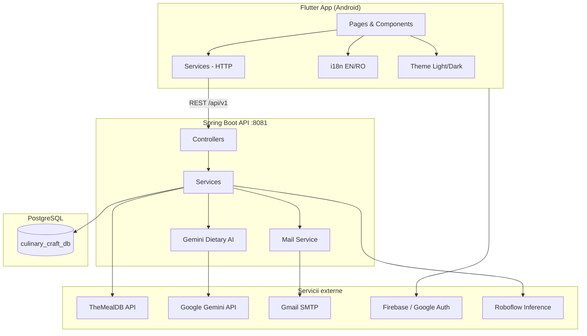
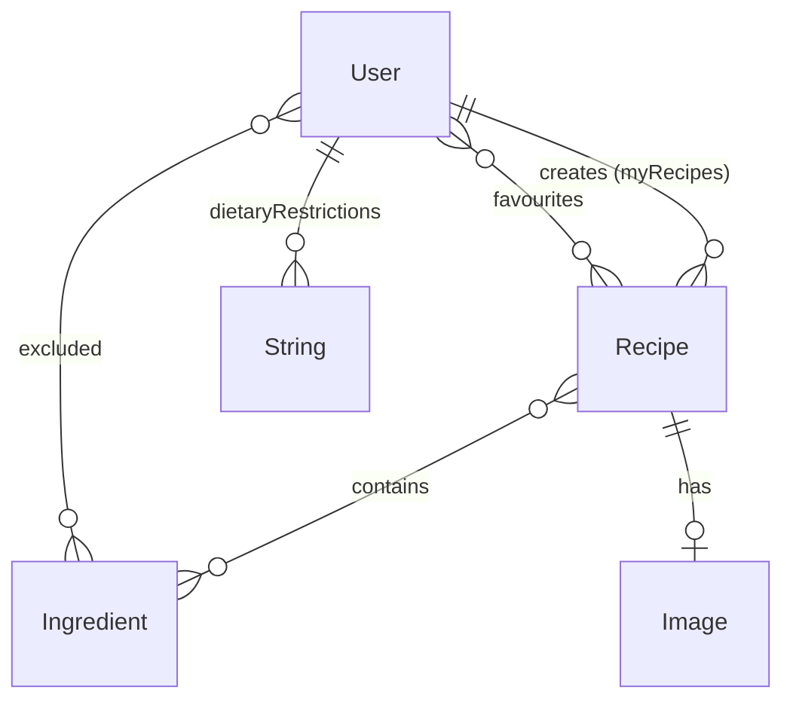

# CulinaryCraft

**Proiect de licență** — aplicație mobilă pentru descoperirea și personalizarea rețetelor culinare. Utilizatorii pot selecta ingrediente, căuta rețete, salva favorite, crea propriile rețete și își pot configura preferințe alimentare filtrate inteligent cu AI.

**Autor:** Bizoi Fabian  
**Repository:** [CulinaryCraft-Final](https://github.com/BizoiFabian/CulinaryCraft-Final)

---

## Cuprins

- [Prezentare generală](#prezentare-generală)
- [Tehnologii folosite](#tehnologii-folosite)
- [Arhitectură](#arhitectură)
- [Structura proiectului](#structura-proiectului)
- [Funcționalități](#funcționalități)
- [Model de date](#model-de-date)
- [API REST](#api-rest)
- [Servicii externe](#servicii-externe)
- [Instalare și rulare locală](#instalare-și-rulare-locală)
- [Variabile de mediu](#variabile-de-mediu)
- [Capturi și demo](#capturi-și-demo)

---

## Prezentare generală

CulinaryCraft este o aplicație **mobile-first** construită cu **Flutter**, conectată la un backend **Spring Boot** și o bază de date **PostgreSQL**. Datele inițiale de rețete și ingrediente provin din **TheMealDB**.

Fluxul principal al utilizatorului:

1. Se înregistrează / se autentifică (email sau Google)
2. Completează un chestionar de preferințe alimentare (opțional, cu AI)
3. Selectează ingrediente disponibile în bucătărie
4. Caută rețete compatibile sau creează rețete proprii
5. Salvează favorite și își gestionează profilul

---

## Tehnologii folosite

### Frontend (Flutter)

| Tehnologie | Rol |
|------------|-----|
| **Flutter / Dart 3** | UI cross-platform (Android) |
| **Material 3** | Design system, teme light/dark |
| **Provider** | State management (temă, limbă) |
| **http** | Apeluri REST către backend |
| **shared_preferences** | Persistență sesiune și setări |
| **intl + flutter_localizations** | Internaționalizare EN / RO |
| **google_fonts** | Tipografie (Inter) |
| **cached_network_image** | Încărcare și cache imagini rețete |
| **image_picker** | Cameră / galerie pentru scanare ingredient |
| **Firebase Core + Auth + Analytics** | Autentificare Google |
| **google_sign_in** | OAuth Google pe mobil |
| **pin_code_fields** | Introducere cod resetare parolă |
| **crypto** | Hash SHA-256 parolă înainte de trimitere |

### Backend (Spring Boot)

| Tehnologie | Versiune / detalii |
|------------|-------------------|
| **Java** | 17 |
| **Spring Boot** | 3.2.3 |
| **Spring Data JPA** | Persistență entități |
| **Hibernate** | ORM, `ddl-auto: update` |
| **PostgreSQL** | Bază de date relațională |
| **Spring WebFlux (WebClient)** | HTTP reactiv (Gemini AI, TheMealDB) |
| **SpringDoc OpenAPI** | 2.1.0 — documentație Swagger |
| **ModelMapper** | Mapare entități ↔ DTO |
| **Lombok** | Reducere boilerplate |
| **Jakarta Mail + Freemarker** | Trimitere email-uri (reset parolă, notificări) |
| **Thymeleaf** | Șabloane HTML email |

### AI & recunoaștere imagini

| Tehnologie | Rol |
|------------|-----|
| **Google Gemini 1.5 Flash** | Analiză preferințe alimentare în limbaj natural |
| **Python + Roboflow Inference** | Recunoaștere ingredient din fotografie (`food.py`) |

### Infrastructură

| Tehnologie | Rol |
|------------|-----|
| **PostgreSQL 16** | Container Docker (`compose.yaml`) |
| **Maven Wrapper** | Build backend fără Maven global |
| **Docker Compose** | PostgreSQL local |

---

## Arhitectură



### Pattern-uri arhitecturale

| Strat | Backend | Frontend |
|-------|---------|----------|
| Prezentare | REST Controllers | `Pages/`, `Components/` |
| Logică business | `service/`, `service/implementation/` | `Services/` |
| Persistență | `repository/`, JPA Entities | `shared_preferences` |
| Transfer date | DTO (request/response) | Modele Dart (`Recipe`, `Ingredient`) |
| Configurare | `application.yaml`, `AiGeminiProperties` | `globals.dart`, `AppSettings` |

### Comunicare client ↔ server

| Platformă | URL API |
|-----------|---------|
| Android Emulator | `http://10.0.2.2:8081/api/v1` |
| Web / localhost | `http://localhost:8081/api/v1` |

Definit în `frontend/culinary_craft/lib/Services/globals.dart`.

---

## Structura proiectului

```
CulinaryCraft/
├── README.md
├── README_DETALIAT.md          # Fluxuri detaliate per ecran
│
├── frontend/culinary_craft/    # Aplicație Flutter
│   ├── lib/
│   │   ├── Components/         # Widget-uri reutilizabile
│   │   ├── Pages/              # Ecrane (Home, Auth, Profile, Recipes...)
│   │   ├── Services/           # Clienți API
│   │   ├── l10n/               # Traduceri EN / RO
│   │   ├── state/              # AppSettings (temă, limbă)
│   │   ├── theme/              # Culori și ThemeData
│   │   └── main.dart
│   ├── android/
│   └── pubspec.yaml
│
└── backend/culinarycraft/culinarycraft/
    ├── pom.xml
    ├── compose.yaml              # PostgreSQL Docker
    └── src/main/
        ├── java/.../culinarycraft/
        │   ├── controller/       # REST endpoints
        │   ├── service/          # Business logic
        │   ├── repository/       # JPA + entități + DTO
        │   ├── config/           # Config AI Gemini
        │   └── utils/            # DataLoader, dietary keywords
        └── resources/
            ├── application.yaml
            └── templates/          # Email-uri HTML
```

---

## Funcționalități

### Autentificare și cont

- Înregistrare și login cu **email + parolă** (parola este hash-uită SHA-256 pe client)
- Login cu **Google** (Firebase + backend sync)
- Recuperare parolă: email cu cod de 4 cifre → verificare → schimbare parolă
- Editare profil (username)
- Dezactivare și ștergere cont (cu notificare email)
- Redirect post-login către chestionarul de preferințe alimentare (prima autentificare)

### Preferințe alimentare & AI (Gemini)

- Chestionar după login: vegetarian, vegan, fără lactate, gluten, nuci etc.
- Câmp text liber: *„sunt alergic la ciuperci, nu mănânc porc”*
- **Google Gemini AI** mapează răspunsurile la ingrediente reale din catalog
- Fallback pe reguli keyword dacă AI nu e configurat
- Ingredientele excluse **nu apar** pe Home
- Rețetele care conțin ingrediente excluse **nu apar** la căutare
- Editabil din **Profile → Preferințe alimentare**

### Ingrediente

- Listare paginată cu infinite scroll
- **Search bar** cu debounce (căutare backend)
- Selectare multiplă pentru căutare rețete
- Scanare ingredient din **cameră sau galerie** (ML food recognition)
- Filtrare automată după preferințele dietetice ale utilizatorului

### Rețete

- Căutare rețete după ingrediente selectate (logică **OR** — rețete cu cel puțin un ingredient)
- Rezultate sortate după numărul de potriviri
- Detalii rețetă: imagine, descriere, listă ingrediente
- Adăugare / eliminare din **favorite**
- Creare rețetă proprie (nume, descriere, ingrediente, imagine upload)
- Ștergere rețetă proprie
- **~605 rețete** importate din TheMealDB

### UI / UX

- Temă **Light / Dark / System**
- Limbă **Română / English**
- Design warm culinary (paletă portocaliu/verde)
- Material 3, carduri animate, header gradient
- Imagini rețete optimizate (`CachedNetworkImage`, raport 16:10)

### Admin

- `POST /api/v1/admin/reload-recipes` — reimportă toate rețetele din TheMealDB

---

## Model de date



### Entități principale

| Entitate | Câmpuri relevante |
|----------|-------------------|
| **User** | username, email, password, loginType, isActive, dietaryPreferencesCompleted |
| **Recipe** | name, description, urlImage, user, ingredients, likes |
| **Ingredient** | name, urlImage |
| **Image** | name, type, imageData (BLOB) |

### Tabele de legătură

- `user_favourites_recipes`
- `recipe_ingredients`
- `user_excluded_ingredients`
- `user_dietary_restrictions`

---

## API REST

**Bază:** `/api/v1`  
**Swagger UI:** `http://localhost:8081/swagger-ui/index.html`

### Autentificare (`AuthController`)

| Metodă | Endpoint | Descriere |
|--------|----------|-----------|
| POST | `/register` | Înregistrare cont |
| POST | `/login` | Autentificare email/parolă |
| POST | `/sign-in-with-google` | Login Google |
| POST | `/forgot-password?email=` | Trimite cod resetare |
| POST | `/verify-code?userId=` | Verifică cod |
| PUT | `/change-password?userId=` | Schimbă parola |
| PUT | `/deactivate-account/{id}` | Dezactivează cont |
| DELETE | `/delete-account/{id}` | Șterge cont |

### Utilizatori (`UserController`)

| Metodă | Endpoint | Descriere |
|--------|----------|-----------|
| PUT | `/users/{id}` | Actualizează profil |

### Preferințe alimentare (`DietaryPreferenceController`)

| Metodă | Endpoint | Descriere |
|--------|----------|-----------|
| GET | `/users/{userId}/dietary-preferences` | Citește preferințe |
| PUT | `/users/{userId}/dietary-preferences` | Salvează preferințe (AI + reguli) |

### Rețete (`RecipeController`)

| Metodă | Endpoint | Descriere |
|--------|----------|-----------|
| GET | `/recipes/{id}` | Detalii rețetă |
| GET | `/recipes/all` | Toate rețetele (paginat) |
| GET | `/recipes/all/user/{id}` | Rețetele utilizatorului |
| GET | `/recipes/favourites/user-id={userId}` | Favorite |
| POST | `/recipes/search?userId=` | Căutare după ingrediente |
| POST | `/recipes/user/{id}` | Creează rețetă (multipart) |
| PUT | `/recipes/user-id={userId}/add-to-favourite/recipe-id={recipeId}` | Adaugă favorite |
| PUT | `/recipes/user-id={userId}/remove-from-favourite/recipe-id={recipeId}` | Elimină favorite |
| DELETE | `/recipes/user-id={userId}/delete/recipe-id={recipeId}` | Șterge rețetă |

### Ingrediente (`IngredientController`)

| Metodă | Endpoint | Descriere |
|--------|----------|-----------|
| GET | `/ingredients?userId=` | Listă paginată (filtrată) |
| GET | `/ingredients/search?query=&userId=` | Căutare după nume |
| GET | `/ingredients/sort=name` | Sortare A-Z |
| GET | `/ingredients/sort=name/desc` | Sortare Z-A |

### Imagini (`ImageController`)

| Metodă | Endpoint | Descriere |
|--------|----------|-----------|
| POST | `/images` | Upload imagine |
| POST | `/images/food-recognition` | Recunoaștere ingredient din poză |
| GET | `/images/{name}` | Descarcă imagine |
| GET | `/images/info/{name}` | Metadata imagine |

### Admin (`AdminController`)

| Metodă | Endpoint | Descriere |
|--------|----------|-----------|
| POST | `/admin/reload-recipes` | Reimportă rețete TheMealDB |

---

## Servicii externe

| Serviciu | Utilizare |
|----------|-----------|
| **[TheMealDB](https://www.themealdb.com/)** | Import ingrediente și rețete la startup / reload |
| **[Google Gemini API](https://aistudio.google.com/)** | Analiză preferințe alimentare cu NLP |
| **Firebase / Google Sign-In** | Autentificare OAuth pe mobil |
| **Gmail SMTP** | Email resetare parolă, notificări cont |
| **Roboflow Inference** | Segmentare imagine mâncare → identificare ingredient |

---

## Instalare și rulare locală

### Cerințe

- **Java 17**
- **Flutter SDK** (Dart 3+)
- **PostgreSQL 16** (Docker sau local)
- **Python 3** + `inference_sdk` (opțional, pentru scanare ingredient)
- Cont **Firebase** cu Google Sign-In activat
- Cheie **GEMINI_API_KEY** (opțional, pentru AI dietary)

### 1. Bază de date (PostgreSQL)

**Opțiunea A — Docker Compose:**

```bash
cd backend/culinarycraft/culinarycraft
docker compose up -d
```

> **Notă:** `compose.yaml` expune portul **5432**. Dacă `application.yaml` folosește **5433**, fie remapezi portul în Docker (`5433:5432`), fie actualizezi URL-ul JDBC.

**Opțiunea B — PostgreSQL existent:**

```yaml
# application.yaml
spring.datasource.url: jdbc:postgresql://localhost:5433/culinary_craft_db
spring.datasource.username: user
spring.datasource.password: password
```

### 2. Backend

```bash
cd backend/culinarycraft/culinarycraft

# Windows PowerShell — cheie Gemini (opțional)
$env:GEMINI_API_KEY="cheia_ta_de_la_google_ai_studio"

./mvnw spring-boot:run
```

- API: `http://localhost:8081/api/v1`
- Swagger: `http://localhost:8081/swagger-ui/index.html`

### 3. Frontend (Flutter)

```bash
cd frontend/culinary_craft
flutter pub get
flutter run
```

Pentru **Android Emulator**, backend-ul este accesibil automat la `10.0.2.2:8081`.

### 4. Firebase (Google Login)

1. Creează proiect în [Firebase Console](https://console.firebase.google.com/)
2. Activează **Google** în Authentication → Sign-in method
3. Descarcă `google-services.json` în `frontend/culinary_craft/android/app/`
4. Adaugă SHA-1 fingerprint al aplicației Android

### 5. Reimport rețete (opțional)

```bash
curl -X POST http://localhost:8081/api/v1/admin/reload-recipes
```

---

## Variabile de mediu

| Variabilă | Obligatoriu | Descriere |
|-----------|-------------|-----------|
| `GEMINI_API_KEY` | Nu | Cheie API Google Gemini pentru preferințe alimentare AI |
| `spring.mail.username` | Da* | Email Gmail pentru SMTP (în `application.yaml`) |
| `spring.mail.password` | Da* | App Password Gmail (în `application.yaml`) |

\* Necesare pentru resetare parolă și notificări email.

> **Important:** Nu comite parole sau chei API în Git. Folosește variabile de mediu sau fișiere locale ignorate de `.gitignore` în producție.

---

## Ecrane principale (Flutter)

| Ecran | Rută | Descriere |
|-------|------|-----------|
| Get Started | `/start` | Ecran de bun venit |
| Onboarding | `/onboarding` | Prezentare aplicație |
| Social Login | `/signin_with_google_or_facebook` | Google + linkuri Sign In/Up |
| Sign In / Sign Up | `/signin`, `/signup` | Autentificare email |
| Preferințe alimentare | `/dietary_preferences` | Chestionar AI |
| Home | `/home` | Ingrediente + căutare rețete |
| Rețete | `/view_recipes` | Rezultate căutare |
| Profile | `/profile` | Setări, favorite, logout |
| Rețetele mele | `/view_my_recipes` | Rețete create de user |
| Favorite | `/view_favorite_recipes` | Rețete salvate |

---

## Capturi și demo

> Adaugă aici screenshot-uri din emulator (Home, Recipes, Dietary Preferences, Profile).

---

## Licență și autor

Proiect realizat ca parte a lucrării de licență.

**Autor:** Bizoi Fabian — [GitHub](https://github.com/BizoiFabian)

---

## Resurse suplimentare

- [README_DETALIAT.md](README_DETALIAT.md) — descriere pas cu pas a fluxurilor din aplicație
- [TheMealDB API](https://www.themealdb.com/api.php)
- [Google AI Studio](https://aistudio.google.com/)
- [Flutter Documentation](https://docs.flutter.dev/)
- [Spring Boot Documentation](https://spring.io/projects/spring-boot)
